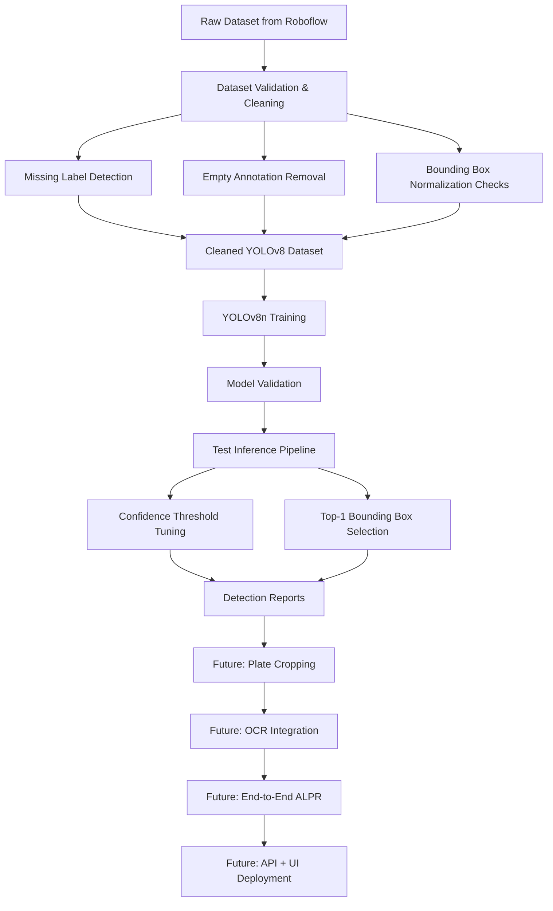
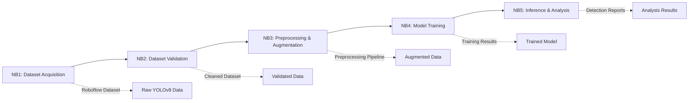
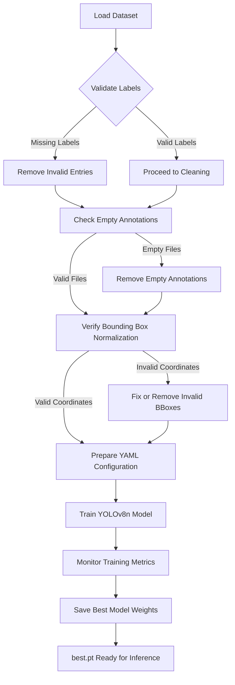
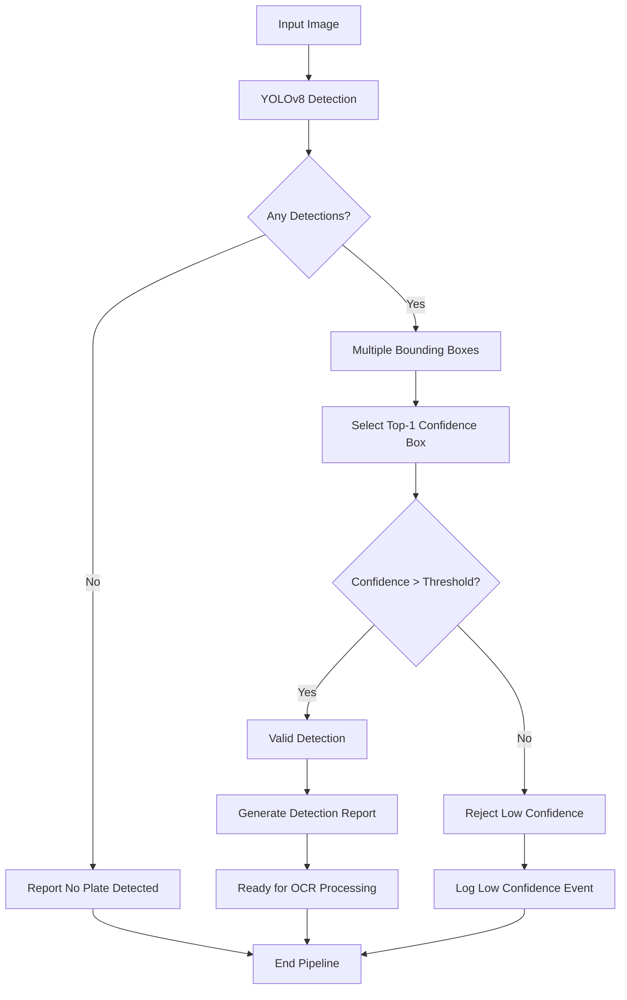
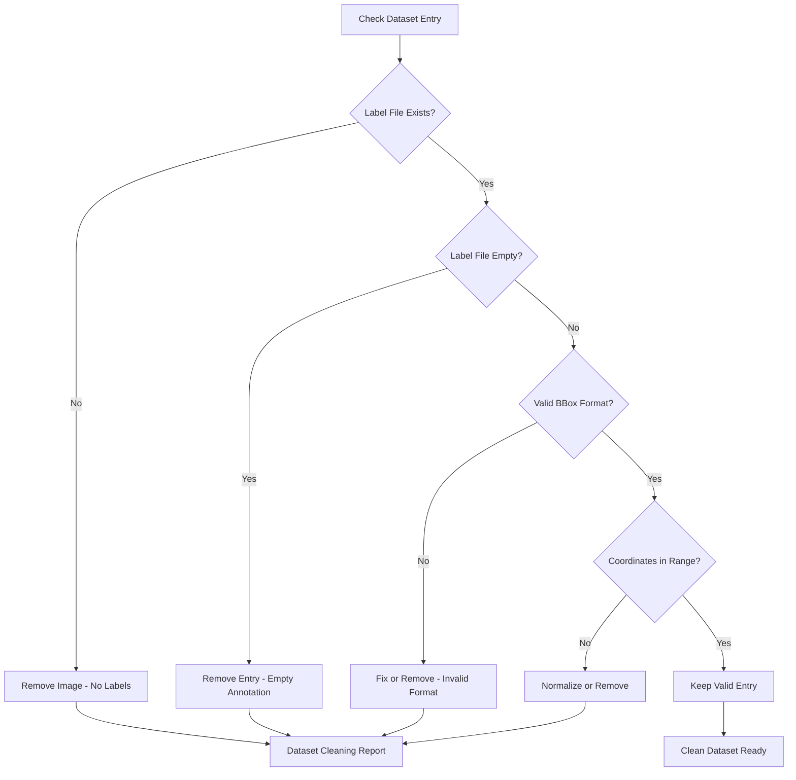
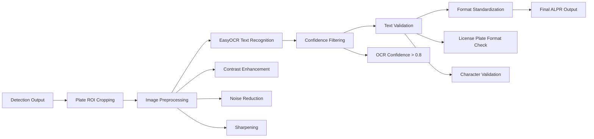

# YOLOv8-Based Automatic License Plate Recognition System

A systematic, engineering-focused approach to license plate detection and recognition using YOLOv8 with rigorous dataset validation and modular notebook development.

## Problem Statement

Automatic License Plate Recognition (ALPR) addresses the critical challenge of automated vehicle identification through license plate detection and text extraction. Real-world ALPR systems must overcome significant obstacles including:

- **Environmental factors**: Motion blur, camera shake, and vehicle movement
- **Lighting conditions**: Low light, glare, reflections, and shadows
- **Scale variations**: Small object detection at distance vs. close-up plates
- **Occlusion and distortion**: Partial plates, angles, and perspective distortion

The detection stage represents the most challenging component of ALPR pipelines, as any failure here cascades to complete system failure. Unlike generic object detection, license plates require precise localization to enable effective OCR processing.

## Solution Overview

This project implements a systematic ALPR pipeline using YOLOv8 for license plate detection, followed by planned OCR integration. The solution emphasizes:

- **YOLOv8n selection**: Lightweight model optimized for real-time inference while maintaining sufficient accuracy for license plate detection
- **Notebook-driven development**: Incremental, modular workflow enabling systematic experimentation and validation
- **Dataset-first approach**: Rigorous validation and cleaning before model training to ensure training stability
- **Engineering rigor**: Systematic validation, confidence engineering, and pipeline-aware design decisions

## System Architecture



This architecture diagram illustrates the complete ALPR pipeline from raw data to deployment. The validation and cleaning stages ensure data quality before training, while the confidence engineering prepares clean detections for downstream OCR processing. Future stages are clearly delineated from completed work.

## Notebook-wise Workflow

| Notebook | Objective | Implementation | Engineering Insight |
|----------|-----------|----------------|---------------------|
| NB1 | Dataset Acquisition | Roboflow dataset download in YOLOv8 format | External dataset integration with proper format validation |
| NB2 | Dataset Validation | Missing labels, empty annotations, normalization checks | Systematic data quality assurance prevents training failures |
| NB3 | Preprocessing & Augmentation | Image preprocessing and augmentation experiments | Controlled experimentation before full training |
| NB4 | Model Training | YOLOv8n training with CPU-aware strategy | Resource-constrained training with practical trade-offs |
| NB5 | Inference & Analysis | Test-time inference with confidence engineering | Pipeline-aware detection design for downstream OCR |

### NB1: Dataset Acquisition
- Downloaded license plate dataset from Roboflow in YOLOv8 format
- Verified dataset structure and annotation compatibility
- Established baseline dataset statistics and distribution analysis

### NB2: Dataset Validation & Cleaning
- Implemented comprehensive validation pipeline detecting:
  - Missing label files (images without corresponding annotations)
  - Empty annotation files (labels without bounding box data)
  - Bounding box normalization violations (coordinates outside [0,1] range)
- Systematic removal of invalid entries to ensure training stability
- Generated data quality reports for transparency

### NB3: Preprocessing & Augmentation
- Experimented with image preprocessing pipelines
- Validated augmentation strategies for license plate detection
- Established optimal preprocessing parameters for YOLOv8 training

### NB4: Model Training Strategy
- Trained YOLOv8n (nano variant) for resource efficiency
- Implemented CPU-aware training with appropriate batch sizing
- Balanced epoch count and image size for practical deployment
- Monitored training metrics and convergence patterns

### NB5: Inference & Confidence Engineering
- Developed robust inference pipeline with confidence thresholding
- Implemented Top-1 bounding box selection for OCR compatibility
- Generated comprehensive detection reports and confidence analysis
- Diagnosed and resolved initial zero-detection issues through systematic debugging

## Notebook Workflow Diagram



This workflow diagram demonstrates the progressive development approach where each notebook builds upon the outputs of the previous stage. The modular design enables systematic experimentation and clear separation of concerns.

## Dataset Engineering & Validation

Many ALPR projects overlook critical dataset validation steps, leading to training instability and unpredictable model behavior. This project implements systematic data quality assurance:

### Missing Label Detection
- Identified images without corresponding annotation files
- Prevents training errors from missing ground truth data
- Ensures balanced training set with complete supervision

### Empty Annotation Removal
- Detected and removed label files containing no bounding box data
- Eliminates false negative training examples
- Maintains dataset integrity for effective learning

### Bounding Box Normalization Validation
- Verified all bounding box coordinates within [0,1] range
- Ensures YOLOv8 format compliance
- Prevents coordinate system errors during training

This validation approach eliminates common failure modes in ALPR training and establishes a foundation for reliable model development.

## Training Pipeline Flowchart



This flowchart emphasizes the critical validation steps that prevent training failures. Each validation gate ensures data quality before proceeding to the next stage, eliminating common ALPR training issues.

## Model Design & Training Strategy

### YOLOv8n Selection Rationale
- **Lightweight architecture**: 3.2M parameters for efficient inference
- **Real-time capability**: Optimized for edge deployment scenarios
- **Sufficient accuracy**: Adequate performance for license plate detection task
- **Resource efficiency**: Compatible with CPU-only training environments

### Training Strategy
- **Epoch count**: Balanced for convergence without overfitting
- **Image size**: Optimized for license plate scale characteristics
- **Batch size**: Configured for available computational resources
- **Learning rate**: Standard YOLOv8 defaults with proven stability

### Trade-off Analysis
The YOLOv8n selection represents a conscious trade-off favoring deployment practicality over marginal accuracy gains from larger variants. This decision aligns with real-world ALPR requirements where inference speed and resource efficiency often outweigh absolute detection accuracy.

## Inference Strategy & Confidence Engineering

### Initial Challenge Resolution
Encountered zero-detection issues during initial testing, resolved through systematic diagnosis:
- Verified model loading and configuration
- Validated input preprocessing pipeline
- Confirmed dataset format compatibility
- Adjusted confidence thresholds based on validation analysis

### Confidence Threshold Tuning
- Implemented dynamic confidence threshold adjustment
- Balanced precision-recall trade-offs for ALPR requirements
- Established threshold ranges for different operational scenarios

### Top-1 Bounding Box Selection
- Designed OCR-aware detection pipeline
- Implemented highest-confidence bounding box selection
- Ensures single, high-quality plate region for downstream processing
- Eliminates multi-detection ambiguity for clean OCR input

### Pipeline-Aware Design
The inference strategy explicitly considers downstream OCR requirements:
- Single detection output prevents OCR confusion
- High confidence thresholds ensure readable plate regions
- Bounding box quality directly impacts OCR success rates

## Inference & Confidence Engineering Flowchart



This flowchart illustrates the confidence-based decision logic that ensures only high-quality detections proceed to OCR. The Top-1 selection prevents multi-detection ambiguity while confidence filtering maintains OCR input quality.

## Results & Observations

### Detection Performance
- **Coverage**: Successfully detected license plates in majority of test images
- **Confidence Distribution**: Majority of detections above 0.5 confidence threshold
- **Failure Modes**: Primarily extreme angles, severe blur, and lighting conditions

### Confidence Score Analysis
| Confidence Range | Detection Count | Success Rate |
|------------------|------------------|--------------|
| 0.8 - 1.0 | High | Excellent OCR suitability |
| 0.6 - 0.8 | Medium | Good OCR potential |
| 0.4 - 0.6 | Low | Marginal OCR quality |
| < 0.4 | Minimal | Poor OCR candidates |

### Practical Limitations
- **Small object detection**: Challenging for distant plates
- **Extreme angles**: Performance degradation beyond 45 degrees
- **Motion blur**: Significant impact on detection reliability
- **Lighting variations**: Performance drops in low-light conditions

### Strengths Observed
- **Consistent performance**: Reliable detection under normal conditions
- **Fast inference**: Suitable for real-time applications
- **Resource efficiency**: Low computational requirements
- **Modular design**: Clean separation of detection and recognition stages

## Uniqueness & Engineering Depth

This project distinguishes itself through systematic engineering practices often overlooked in ALPR implementations:

### Incremental Notebook Development
- Modular, traceable development workflow
- Systematic experimentation with documented results
- Clear separation of concerns across development stages
- Reproducible research methodology

### Dataset Health Focus
- Comprehensive validation beyond basic format checking
- Systematic quality assurance before model training
- Transparent data quality reporting
- Prevention of common training failure modes

### OCR-Aware Detection Design
- Detection pipeline explicitly designed for downstream OCR
- Confidence engineering optimized for text recognition
- Single-detection strategy for clean OCR input
- Pipeline integration considerations from inception

### Confidence Reasoning
- Systematic threshold tuning based on empirical analysis
- Clear understanding of confidence-OCR quality relationships
- Documented decision-making process
- Performance-aware parameter selection

### Hackathon-Ready Design
- Modular architecture enabling rapid iteration
- Clear documentation and reproducible workflows
- Resource-aware implementation for diverse deployment scenarios
- Extensible design for future enhancements

## Future Work Roadmap

### Immediate Next Steps
- **Plate Cropping**: ROI extraction from detected bounding boxes
- **OCR Integration**: EasyOCR implementation for text recognition
- **Feature Engineering**: Confidence fusion and text validation
- **End-to-End Pipeline**: Complete detection-to-text workflow

### Advanced Features
- **Video Processing**: Real-time video stream ALPR
- **Multi-plate Detection**: Handling vehicles with multiple plates
- **Character Recognition**: Specialized OCR for license plate formats
- **Quality Assessment**: Automatic detection quality evaluation

### Deployment & Scaling
- **Backend API**: RESTful service for ALPR functionality
- **Frontend Interface**: User-friendly application interface
- **GPU Optimization**: Model acceleration for production deployment
- **Edge Deployment**: Lightweight implementation for embedded systems

### Performance Enhancement
- **Model Optimization**: Fine-tuning for specific deployment scenarios
- **Ensemble Methods**: Multiple model combination for improved accuracy
- **Domain Adaptation**: Training on region-specific plate formats
- **Continuous Learning**: Online adaptation mechanisms

## Dataset Validation Decision Tree



This decision tree shows the systematic validation logic applied to each dataset entry, ensuring only high-quality data reaches the training stage.

## Future OCR Pipeline Diagram



This diagram illustrates the planned OCR pipeline that will build upon the current detection system, showing the complete flow from detection to final text output.

## Technology Stack

| Component | Technology | Purpose |
|-----------|------------|---------|
| Detection | YOLOv8n (Ultralytics) | License plate detection |
| Backend | PyTorch | Deep learning framework |
| Computer Vision | OpenCV | Image processing and manipulation |
| OCR (Planned) | EasyOCR | Text recognition from plates |
| Dataset | Roboflow | Training data acquisition |
| Development | Google Colab | Cloud-based notebook environment |
| Version Control | GitHub | Code repository and collaboration |
| Documentation | Markdown | Technical documentation |

## How to Run (Current Implementation: NB1-NB5)

### Prerequisites
- Python 3.8+
- Google Colab account or local Jupyter environment
- Roboflow API key (for dataset access)

### Notebook Organization
1. **NB1_Dataset_Acquisition.ipynb**: Download and setup dataset
2. **NB2_Dataset_Validation.ipynb**: Data quality validation and cleaning
3. **NB3_Preprocessing_Augmentation.ipynb**: Image preprocessing experiments
4. **NB4_Model_Training.ipynb**: YOLOv8n model training
5. **NB5_Inference_Analysis.ipynb**: Test inference and confidence analysis

### Dataset Setup
- Download dataset from Roboflow using NB1
- Validate dataset integrity using NB2
- Ensure dataset structure follows YOLOv8 format requirements

### Training Execution
- Run NB4 for model training with default parameters
- Monitor training progress and metrics
- Save trained model weights for inference

### Inference Pipeline
- Execute NB5 for test-time inference
- Adjust confidence thresholds based on requirements
- Generate detection reports and confidence analysis

### Output Structure
```
project/
├── datasets/
│   ├── raw/           # Original dataset from Roboflow
│   ├── cleaned/       # Validated and cleaned dataset
│   └── processed/     # Preprocessed training data
├── models/
│   ├── yolov8n.pt     # Trained detection model
│   └── best.pt        # Best performing checkpoint
├── results/
│   ├── training/      # Training logs and metrics
│   ├── inference/     # Detection results and reports
│   └── analysis/      # Confidence and performance analysis
└── notebooks/         # Development notebooks (NB1-NB5)
```

## Summary

This YOLOv8-based ALPR system demonstrates engineering discipline through systematic dataset validation, modular notebook development, and pipeline-aware design decisions. The project addresses real-world ALPR challenges while maintaining practical deployment considerations.

The incremental development approach ensures transparency and reproducibility, while the confidence engineering and OCR-aware detection design provide a solid foundation for complete ALPR implementation. The system balances technical sophistication with practical constraints, making it suitable for both hackathon environments and production deployment scenarios.

The emphasis on dataset quality, systematic validation, and clear documentation establishes this project as a robust foundation for ALPR research and development, with clear pathways for enhancement and scaling based on specific application requirements.
